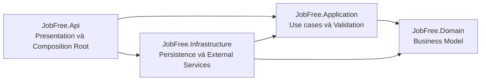
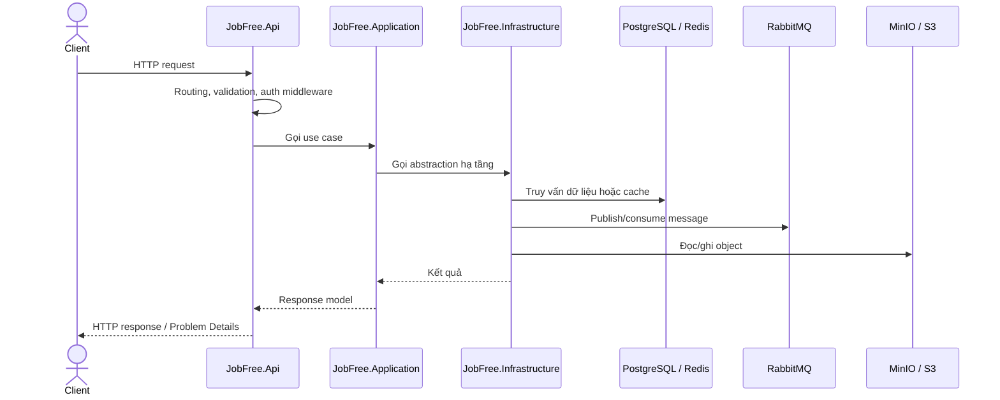
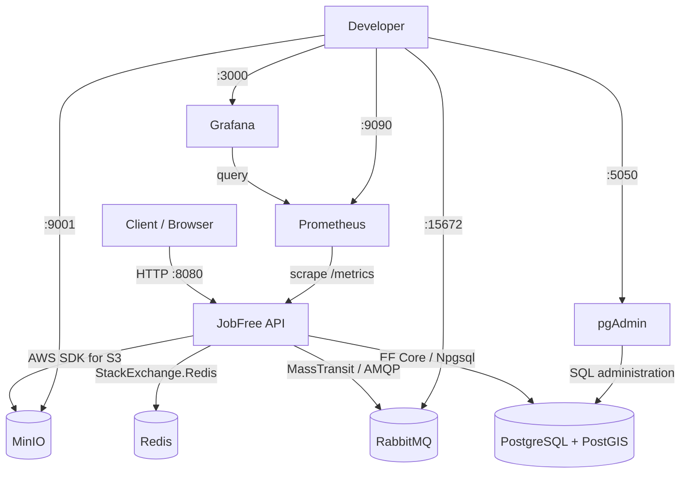

# Kiến trúc và hạ tầng JobFree Backend

Tài liệu này mô tả kiến trúc đang tồn tại trong repository JobFree Backend, cách các thành phần phụ thuộc lẫn nhau và vai trò của từng dịch vụ hạ tầng trong môi trường local. Nội dung phản ánh code hiện tại; các phần chưa triển khai được ghi rõ là **skeleton** hoặc **định hướng**.

## 1. Tổng quan

JobFree Backend được xây dựng bằng .NET 8 theo hướng Clean Architecture. Ứng dụng được đóng gói bằng Docker và chạy cùng PostgreSQL/PostGIS, Redis, RabbitMQ, MinIO, Prometheus, Grafana và pgAdmin thông qua Docker Compose.

Các mục tiêu kiến trúc hiện tại:

- Tách nghiệp vụ khỏi framework và hạ tầng.
- Đăng ký dependency tập trung tại composition root của API.
- Cấu hình bằng biến môi trường, không đưa credential local lên Git.
- Cung cấp health check, metrics, tracing và structured logging ngay từ đầu.
- Cho phép thay MinIO local bằng dịch vụ tương thích S3 khi triển khai.

## 2. Kiến trúc source code



Quy tắc phụ thuộc:

- `JobFree.Domain` nằm ở lõi và không tham chiếu project nào khác.
- `JobFree.Application` phụ thuộc `Domain`, chứa orchestration của use case và validation.
- `JobFree.Infrastructure` hiện thực các kết nối kỹ thuật và phụ thuộc `Application` cùng `Domain`.
- `JobFree.Api` là composition root, ghép `Application` và `Infrastructure` thành ứng dụng chạy được.
- Các project test tham chiếu trực tiếp layer cần kiểm thử.

### Vai trò từng project

| Project | Trách nhiệm hiện tại | Không nên chứa |
|---|---|---|
| `JobFree.Domain` | Entity, value object, domain rule và domain event | EF Core, HTTP, Redis, RabbitMQ hoặc SDK bên ngoài |
| `JobFree.Application` | Use case, validation, abstraction/port và orchestration | Chi tiết database, broker hoặc web framework |
| `JobFree.Infrastructure` | EF Core, PostgreSQL/PostGIS, Redis, MassTransit/RabbitMQ, S3/MinIO và health checks | HTTP endpoint hoặc business rule |
| `JobFree.Api` | HTTP pipeline, Swagger, CORS, WebSocket middleware, telemetry, error handling và dependency composition | Business rule hoặc truy cập dữ liệu trực tiếp |

`JobFree.Api` phụ thuộc `Infrastructure` là có chủ đích vì đây là composition root. Các layer bên trong không phụ thuộc ngược lại vào API.

## 3. Luồng xử lý ứng dụng



Hiện tại repository mới là nền tảng kỹ thuật: chưa có entity nghiệp vụ, database migration, business endpoint, RabbitMQ consumer hoặc WebSocket upgrade endpoint. Khi thêm feature, use case nên đặt dưới `JobFree.Application/Features/<Feature>` và mapping EF Core đặt dưới `JobFree.Infrastructure/Persistence/Configurations`.

## 4. Kiến trúc runtime và Docker Compose



Trong mạng Compose, các container gọi nhau bằng service name như `postgres`, `redis`, `rabbitmq`, `minio`, `api` và `prometheus`. Các port host đều bind vào `127.0.0.1`, vì vậy mặc định chỉ truy cập được từ máy local.

### Thứ tự khởi động

```text
postgres ─┐
redis ────┤
rabbitmq ─┼─> api ─> prometheus ─> grafana
minio ────┘

postgres ─> pgadmin
```

Docker Compose chỉ khởi động service phụ thuộc sau khi health check của service trước đó thành công.

## 5. Danh mục hạ tầng tích hợp

| Thành phần | Image/công nghệ | Vai trò | Địa chỉ local mặc định | Dữ liệu |
|---|---|---|---|---|
| API | .NET 8 / ASP.NET Core | HTTP API, health, Swagger, metrics | `http://127.0.0.1:8080` | Container stateless |
| PostgreSQL | `postgis/postgis:16-3.5` | Database quan hệ và dữ liệu không gian PostGIS | `127.0.0.1:15432` | Volume `postgres-data` |
| Redis | `redis:7.4-alpine` | Distributed cache | `127.0.0.1:6379` | Không persistence trong cấu hình local |
| RabbitMQ | `rabbitmq:4.1-management-alpine` | Message broker qua MassTransit | AMQP `:5672`, UI `:15672` | Volume `rabbitmq-data` |
| MinIO | `minio/minio` | Object storage tương thích S3 | API `:9000`, UI `:9001` | Volume `minio-data` |
| Prometheus | `prom/prometheus:v3.5.0` | Thu thập và lưu metrics | `http://127.0.0.1:9090` | Volume `prometheus-data` |
| Grafana | `grafana/grafana:12.1.1` | Dashboard và truy vấn Prometheus | `http://127.0.0.1:3000` | Volume `grafana-data` |
| pgAdmin | `dpage/pgadmin4:9.17` | Quản trị PostgreSQL qua web | `http://127.0.0.1:5050` | Volume `pgadmin-data` |

### PostgreSQL và PostGIS

- `JobFreeDbContext` sử dụng EF Core với Npgsql và NetTopologySuite.
- Extension `postgis` được khai báo trong model.
- Chưa có entity hoặc migration nghiệp vụ.
- Readiness check gọi `Database.CanConnectAsync`.

### Redis

- Một `IConnectionMultiplexer` singleton được dùng chung cho cache và health check.
- `AbortOnConnectFail=false` cho phép ứng dụng tiếp tục retry khi Redis khởi động chậm.
- Cấu hình local tắt snapshot và append-only file, nên dữ liệu cache mất khi container bị tạo lại.

### RabbitMQ và MassTransit

- API kết nối RabbitMQ qua MassTransit.
- Credential được truyền riêng qua configuration, không nhúng vào URI.
- MassTransit tự đăng ký health check `masstransit-bus`.
- Chưa có consumer, message contract, retry policy, outbox hoặc dead-letter strategy; cần thiết kế cùng từng use case.

### MinIO và AWS S3

- Ứng dụng sử dụng `IAmazonS3`, do đó code client tương thích cả MinIO local và AWS S3.
- Khi dùng MinIO, SDK bật path-style URL và authentication region.
- Credential local đi qua AWS SDK credential chain từ biến môi trường.
- Readiness kiểm tra bucket cụ thể nếu `S3_HEALTH_CHECK_BUCKET` được cấu hình; nếu để trống, hệ thống gọi `ListBuckets`.

### Prometheus, Grafana và OpenTelemetry

- OpenTelemetry instrument ASP.NET Core, HTTP client và runtime metrics.
- Endpoint `/metrics` chỉ bật khi `Telemetry:Prometheus:Enabled=true`.
- Prometheus scrape `api:8080/metrics` mỗi 15 giây.
- Grafana tự provision Prometheus làm datasource mặc định.
- Trace chỉ được export qua OTLP khi `OTEL_EXPORTER_OTLP_ENDPOINT` tồn tại.
- Health và metrics request bị loại khỏi tracing để giảm nhiễu.

### pgAdmin

- Server PostgreSQL local được provision qua `servers.json` nội tuyến từ Compose.
- pgAdmin lưu user và cấu hình UI trong `pgadmin-data`.
- `PGADMIN_DEFAULT_PASSWORD` chỉ là giá trị khởi tạo; đổi biến sau khi volume đã tồn tại không tự đổi mật khẩu trong database nội bộ của pgAdmin.

## 6. Cấu hình và secrets

File `.env` đặt ở thư mục gốc, được chuyển riêng cho thành viên dự án và bị Git bỏ qua. Không ghi credential thật vào README, source code, issue, commit hoặc Pull Request.

Các nhóm biến chính:

| Nhóm | Biến |
|---|---|
| PostgreSQL | `POSTGRES_DB`, `POSTGRES_USER`, `POSTGRES_PASSWORD`, `POSTGRES_PORT` |
| Redis | `REDIS_PASSWORD`, `REDIS_PORT` |
| RabbitMQ | `RABBITMQ_USER`, `RABBITMQ_PASSWORD`, `RABBITMQ_PORT`, `RABBITMQ_MANAGEMENT_PORT` |
| MinIO/S3 | `MINIO_ROOT_USER`, `MINIO_ROOT_PASSWORD`, `S3_REGION`, `S3_HEALTH_CHECK_BUCKET` |
| Grafana | `GRAFANA_ADMIN_USER`, `GRAFANA_ADMIN_PASSWORD`, `GRAFANA_PORT` |
| pgAdmin | `PGADMIN_DEFAULT_EMAIL`, `PGADMIN_DEFAULT_PASSWORD`, `PGADMIN_PORT` |
| API/monitoring | `API_PORT`, `PROMETHEUS_PORT` |

Docker Compose chuyển các biến cần thiết vào API dưới dạng configuration key của ASP.NET Core, ví dụ `ConnectionStrings__Database`, `RabbitMq__Username` và `S3__ServiceUrl`.

Lưu ý: các biến khởi tạo user của PostgreSQL, RabbitMQ, Grafana và pgAdmin có thể chỉ có hiệu lực trên volume mới. Khi đổi credential của một hệ thống đã có dữ liệu, cần đồng bộ user bên trong dịch vụ trước khi khởi động lại bằng `.env` mới.

## 7. Health checks và endpoint vận hành

| Endpoint | Mục đích | Kết quả mong đợi |
|---|---|---|
| `/health/live` | Xác nhận process API đang chạy | HTTP 200 |
| `/health/ready` | Kiểm tra database/cache, RabbitMQ bus và object storage | HTTP 200, các check `Healthy` |
| `/metrics` | Prometheus/OpenMetrics | HTTP 200 khi metrics được bật |
| `/swagger` | Swagger UI trong Development hoặc khi được bật | Giao diện OpenAPI |

Lỗi HTTP chưa xử lý được chuẩn hóa thành RFC 7807 Problem Details và có `traceId`. Log lỗi 500 chỉ ghi loại exception và trace ID, tránh đưa credential hoặc dữ liệu cá nhân vào log.

## 8. Persistence và vòng đời dữ liệu local

Các named volume được giữ lại khi chạy `docker compose down`:

- `postgres-data`
- `rabbitmq-data`
- `minio-data`
- `prometheus-data`
- `grafana-data`
- `pgadmin-data`

Redis hiện không có volume và được cấu hình như cache tạm thời. Không chạy `docker compose down -v` nếu chưa xác nhận có thể xóa toàn bộ dữ liệu local.

## 9. Kiểm thử và CI

GitHub Actions hiện chạy trên mọi `push` và `pull_request`:

1. Restore .NET tools và NuGet packages.
2. Build solution ở cấu hình Release.
3. Chạy test.
4. Kiểm tra format bằng `dotnet format --verify-no-changes`.
5. Validate Docker Compose bằng credential ngẫu nhiên của CI.
6. Build Docker image của API.

Các test project được chia theo layer: `JobFree.Api.Tests`, `JobFree.Application.Tests`, `JobFree.Domain.Tests` và `JobFree.Infrastructure.Tests`.

## 10. Giới hạn hiện tại và hướng phát triển

Các phần sau chưa phải chức năng hoàn chỉnh:

- Authentication/authorization mới chỉ đăng ký middleware, chưa có scheme và policy.
- Domain và Application chưa có use case nghiệp vụ.
- Chưa có EF Core migration hoặc bảng nghiệp vụ.
- Chưa có RabbitMQ consumer, outbox, retry và dead-letter policy.
- WebSocket middleware đã bật nhưng chưa có endpoint, protocol hoặc auth riêng.
- Grafana chưa provision dashboard hoặc alert rule.
- Data Protection key của API chưa được persist ngoài container.
- Workflow deployment AWS/ECS mới là placeholder, chưa có OIDC/IAM và tài nguyên thật.

Mỗi thay đổi kiến trúc nên cập nhật tài liệu này trong cùng Pull Request để sơ đồ, cấu hình và code không lệch nhau.
