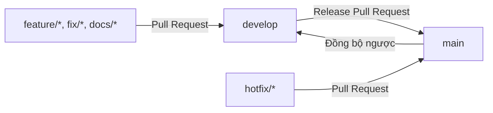

# Quy trình Git và GitHub cho JobFree

Tài liệu này quy định cách tạo nhánh, commit, push, mở Pull Request và phát hành thay đổi. Mục tiêu là giữ `main` ổn định, mọi thay đổi có lịch sử rõ ràng và chỉ được merge sau khi CI thành công.

## 1. Mô hình nhánh



| Nhánh | Vai trò | Push trực tiếp |
|---|---|---|
| `main` | Phiên bản ổn định, sẵn sàng release/production | Không |
| `develop` | Nhánh tích hợp cho thay đổi sắp phát hành | Không |
| `feature/<ten>` | Tính năng mới, tách từ `develop` | Có, sau đó mở PR vào `develop` |
| `fix/<ten>` | Sửa lỗi chưa có trên production, tách từ `develop` | Có, sau đó mở PR vào `develop` |
| `docs/<ten>` | Thay đổi tài liệu, tách từ `develop` | Có, sau đó mở PR vào `develop` |
| `hotfix/<ten>` | Sửa lỗi production khẩn cấp, tách từ `main` | Có, sau đó mở PR vào `main` |

Không phát triển trực tiếp trên `main` hoặc `develop`. Mỗi nhánh ngắn hạn chỉ giải quyết một mục tiêu để Pull Request nhỏ, dễ review và dễ revert.

## 2. Chuẩn bị repository lần đầu

```powershell
git clone https://github.com/TriTin3011/JobFree.git
Set-Location JobFree
git fetch --all --prune
git switch develop
git pull --ff-only origin develop
```

Nhận file `.env` từ người quản lý dự án qua kênh riêng và đặt tại thư mục gốc. Xác nhận Git đang bỏ qua file:

```powershell
git check-ignore -v .env
```

Nếu lệnh không in ra rule `.gitignore`, dừng lại và không commit.

## 3. Quy trình làm việc hằng ngày

### Bước 1: Đồng bộ `develop`

```powershell
git switch develop
git pull --ff-only origin develop
```

`--ff-only` ngăn Git tự tạo merge commit ngoài ý muốn khi local đã lệch remote.

### Bước 2: Tạo nhánh công việc

```powershell
git switch -c feature/job-search
```

Ví dụ tên nhánh:

- `feature/create-job-posting`
- `fix/redis-timeout`
- `docs/update-architecture`
- `refactor/storage-client`
- `chore/update-dependencies`

Tên nhánh dùng chữ thường, dấu gạch ngang và mô tả đúng một mục tiêu.

### Bước 3: Phát triển và kiểm tra thay đổi

Theo dõi thay đổi thường xuyên:

```powershell
git status --short
git diff
```

Trước khi commit code, chạy bộ kiểm tra tương ứng với CI:

```powershell
dotnet restore JobFree.sln
dotnet build JobFree.sln -c Release --no-restore
dotnet test JobFree.sln -c Release --no-build --no-restore
dotnet format JobFree.sln --verify-no-changes --no-restore
docker compose config --quiet
docker build --tag jobfree-api:verify .
```

Nếu thay đổi runtime hoặc hạ tầng, chạy stack và kiểm tra readiness:

```powershell
docker compose up -d --build --wait --wait-timeout 180
Invoke-RestMethod http://127.0.0.1:8080/health/ready
docker compose ps
```

### Bước 4: Stage có kiểm soát

Ưu tiên stage file cụ thể thay vì mặc định dùng `git add .`:

```powershell
git add src/JobFree.Application/Features
git add tests/JobFree.Application.Tests
git diff --cached --check
git diff --cached
```

Trước khi commit, luôn kiểm tra:

```powershell
git status --short
git ls-files .env
```

Lệnh thứ hai phải không trả về kết quả. Không stage `.env`, credential, access token, private key, file chứng chỉ hoặc dữ liệu production.

### Bước 5: Commit

Dùng Conventional Commits:

```text
<type>(<scope>): <mô tả ngắn>
```

Các `type` thường dùng:

| Type | Khi sử dụng | Ví dụ |
|---|---|---|
| `feat` | Thêm chức năng | `feat(jobs): add job search endpoint` |
| `fix` | Sửa lỗi | `fix(cache): handle redis reconnect` |
| `docs` | Chỉ thay tài liệu | `docs: document infrastructure architecture` |
| `test` | Thêm hoặc sửa test | `test(api): cover readiness response` |
| `refactor` | Đổi cấu trúc, không đổi hành vi | `refactor(storage): isolate s3 configuration` |
| `perf` | Cải thiện hiệu năng | `perf(database): add search index` |
| `chore` | Công việc bảo trì | `chore: update dotnet dependencies` |
| `ci` | Thay đổi pipeline | `ci: require release build` |

Ví dụ commit:

```powershell
git commit -m "feat(jobs): add job search endpoint"
```

Một commit nên hoàn chỉnh, build được và chỉ chứa các thay đổi liên quan. Không dùng thông điệp mơ hồ như `update`, `fix stuff` hoặc `done`.

### Bước 6: Đồng bộ trước khi push

Nếu `develop` đã thay đổi trong lúc làm việc:

```powershell
git fetch origin
git rebase origin/develop
```

Chỉ rebase nhánh cá nhân chưa được người khác dùng chung. Sau khi giải quyết conflict, chạy lại test liên quan.

### Bước 7: Push nhánh

```powershell
git push -u origin feature/job-search
```

Các lần tiếp theo chỉ cần:

```powershell
git push
```

Không dùng `--force` trên `main` hoặc `develop`. Nếu thật sự phải cập nhật nhánh cá nhân sau rebase, dùng `--force-with-lease`, không dùng `--force`:

```powershell
git push --force-with-lease
```

### Bước 8: Tạo Pull Request vào `develop`

Pull Request cần có:

- Tiêu đề theo Conventional Commits.
- Mục tiêu và lý do thay đổi.
- Những phần đã thay đổi.
- Cách kiểm thử và kết quả.
- Ảnh hoặc log ngắn nếu thay đổi giao diện/vận hành.
- Migration, biến môi trường hoặc ảnh hưởng tương thích nếu có.
- Issue liên quan bằng `Closes #<so-issue>` khi phù hợp.

Checklist trước merge:

- [ ] PR chỉ giải quyết một mục tiêu.
- [ ] Không có `.env`, secret hoặc dữ liệu nhạy cảm.
- [ ] Build, test, format và Compose validation thành công.
- [ ] CI `verify` trên GitHub thành công.
- [ ] Comment review đã được xử lý.
- [ ] Tài liệu và test đã cập nhật khi hành vi thay đổi.
- [ ] Không có file sinh tự động như `bin/`, `obj/` hoặc `TestResults/`.

Đối với nhánh ngắn hạn vào `develop`, ưu tiên **Squash and merge** để mỗi PR tạo một commit rõ ràng trên nhánh tích hợp.

### Bước 9: Dọn nhánh sau merge

```powershell
git switch develop
git pull --ff-only origin develop
git branch -d feature/job-search
git push origin --delete feature/job-search
git fetch --prune
```

Chỉ xóa nhánh sau khi đã xác nhận PR được merge.

## 4. Phát hành từ `develop` sang `main`

Khi `develop` đã ổn định:

1. Tạo Pull Request từ `develop` vào `main`.
2. Ghi release summary, thay đổi cấu hình và migration cần chạy.
3. Chờ toàn bộ required status checks thành công.
4. Review diff tổng thể và kế hoạch rollback.
5. Dùng **Create a merge commit** để giữ quan hệ lịch sử giữa hai nhánh dài hạn.
6. Gắn tag sau khi merge thành công.

Ví dụ tạo tag:

```powershell
git switch main
git pull --ff-only origin main
git tag -a v0.1.0 -m "JobFree v0.1.0"
git push origin v0.1.0
```

Sau release, đồng bộ commit merge từ `main` về `develop` bằng Pull Request `main` → `develop` hoặc quy trình đồng bộ được quản trị viên phê duyệt. Việc này tránh hai nhánh dài hạn bị phân kỳ.

## 5. Hotfix production

Hotfix bắt đầu từ `main`, không từ `develop`:

```powershell
git switch main
git pull --ff-only origin main
git switch -c hotfix/critical-login-error
```

Sau khi kiểm tra:

1. Push `hotfix/*` và mở PR vào `main`.
2. Merge và phát hành patch version, ví dụ `v0.1.1`.
3. Mở PR từ `main` về `develop` để không làm mất bản sửa trong release kế tiếp.

## 6. Xử lý conflict

Trước tiên cập nhật branch đích và rebase nhánh cá nhân:

```powershell
git fetch origin
git rebase origin/develop
```

Sau khi sửa từng file conflict:

```powershell
git add <duong-dan-file>
git rebase --continue
```

Muốn hủy rebase và trở về trạng thái trước đó:

```powershell
git rebase --abort
```

Không chọn toàn bộ một phía của conflict nếu chưa hiểu cả hai thay đổi. Sau khi giải quyết, chạy lại build và test.

## 7. Khi commit nhầm secret

Nếu secret mới chỉ được stage, bỏ khỏi staging:

```powershell
git restore --staged .env
```

Nếu đã commit nhưng chưa push, bỏ file khỏi Git index, bảo đảm `.gitignore` có rule phù hợp rồi sửa commit.

Nếu secret đã push lên GitHub:

1. Thu hồi hoặc rotate secret ngay lập tức; xóa file khỏi commit mới không làm secret biến mất khỏi lịch sử.
2. Thông báo người quản lý repository.
3. Xác định phạm vi ảnh hưởng trong commit, log CI và artifact.
4. Chỉ rewrite lịch sử khi đã thống nhất với toàn đội vì thao tác này ảnh hưởng mọi clone và branch.

Không đăng secret vào Issue hoặc Pull Request khi trao đổi sự cố.

## 8. Cấu hình GitHub được khuyến nghị

Tạo ruleset hoặc branch protection cho `main` và `develop`:

- Require a pull request before merging.
- Require status check `verify` to pass.
- Require conversation resolution before merging.
- Block force pushes và branch deletion.
- Require branch to be up to date trước khi merge nếu thời gian CI cho phép.
- `main`: yêu cầu ít nhất một approval khi dự án có từ hai thành viên trở lên.
- `develop`: có thể không yêu cầu approval khi chỉ có một thành viên, nhưng vẫn bắt buộc PR và CI.

GitHub dùng Pull Request để thảo luận, review diff và theo dõi checks trước khi merge. Tham khảo:

- [About protected branches](https://docs.github.com/en/repositories/configuring-branches-and-merges/in-your-repository/managing-protected-branches/about-protected-branches)
- [Pull requests](https://docs.github.com/en/pull-requests/reference/pull-requests)
- [Status checks](https://docs.github.com/en/pull-requests/reference/status-checks)

## 9. Checklist nhanh

```text
develop mới nhất
  ↓
tạo feature/fix/docs branch
  ↓
thay đổi nhỏ, có test/tài liệu
  ↓
build + test + format + Compose validation
  ↓
kiểm tra diff và secret
  ↓
commit theo Conventional Commits
  ↓
push branch
  ↓
PR vào develop + CI + review
  ↓
squash merge và xóa branch
  ↓
release PR develop → main
```
